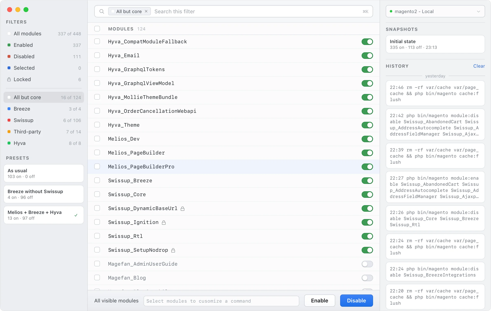

# MageDeck

Regularly switching Magento modules? This app will make your routine much easier.

<picture>
    <source media="(prefers-color-scheme: dark)" srcset="./app-screenshot-dark.webp" width="1200">
    
</picture>

## Installation

Download the latest release from [Releases](https://github.com/vovayatsyuk/magedeck/releases)
and run the executable. The app is not signed, so you may need to allow it
in your system settings.

### MacOS

 1. After you copied the app to the Applications folder, run the following command:

    ```bash
    xattr -c "/Applications/MageDeck.app"
    ```

 2. Now, find "MageDeck.app" in the Applications folder, right click on the App and
    choose "Open" in the context menu.

### Ubuntu

 1. Double click the downloaded `deb` file and install it.
 2. Run the app.

## Development

```bash
npm install
npm run tauri dev
```
